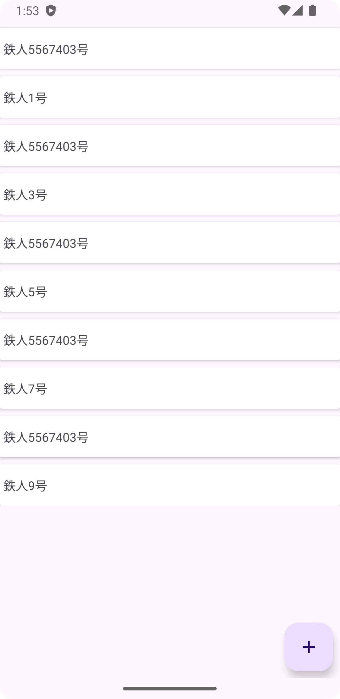

Javaを使ったRecyclerViewのサンプル<br>
Android javaは現状javaのrecordを使えないのでequalsとhashcodeをカスタムする必要があるのが注意点<br>
https://docs.oracle.com/javase/jp/15/language/records.html<br>
https://docs.oracle.com/javase/jp/21/docs/api/java.base/java/lang/Record.html<BR>

# development env
```
Android Studio Jellyfish | 2023.3.1 Nightly 2024-01-04
Build #AI-233.13135.103.2331.11277400, built on January 5, 2024
Runtime version: 17.0.9+0-17.0.9b1087.9-11255266 x86_64
VM: OpenJDK 64-Bit Server VM by JetBrains s.r.o.
macOS 14.1.1
GC: G1 Young Generation, G1 Old Generation
Memory: 4096M
Cores: 16
Metal Rendering is ON
Registry:
  debugger.new.tool.window.layout=true
Non-Bundled Plugins:
  wu.seal.tool.jsontokotlin (3.7.4)
```

# capture


